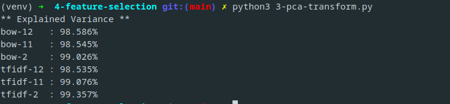

# Etapa 0: Datasets

# Etapa 1: Exploracion de datos
<!-- checklist -->
- [x] Cargar los datos
- [x] Visualizar los datos
- [x] Estadisticas basicas

# Etapa 2: Preprocesamiento
<!-- checklist -->
- [ ] Limpieza de datos
- [ ] Normalizacion
- [ ] Discretizacion
- [ ] Reduccion de dimensionalidad

# Etapa 3: Vectorizacion
<!-- checklist -->
- [x] Bag of words
- [x] TF-IDF

# Etapa 4: Seleccion de caracteristicas
<!-- checklist -->
- [x] Relabeling
- [x] Chi-cuadrado
- [x] PCA investigate
- [x] PCA transform

# Etapa 5: Seleccion de modelo

# Etapa 6: Evaluacion